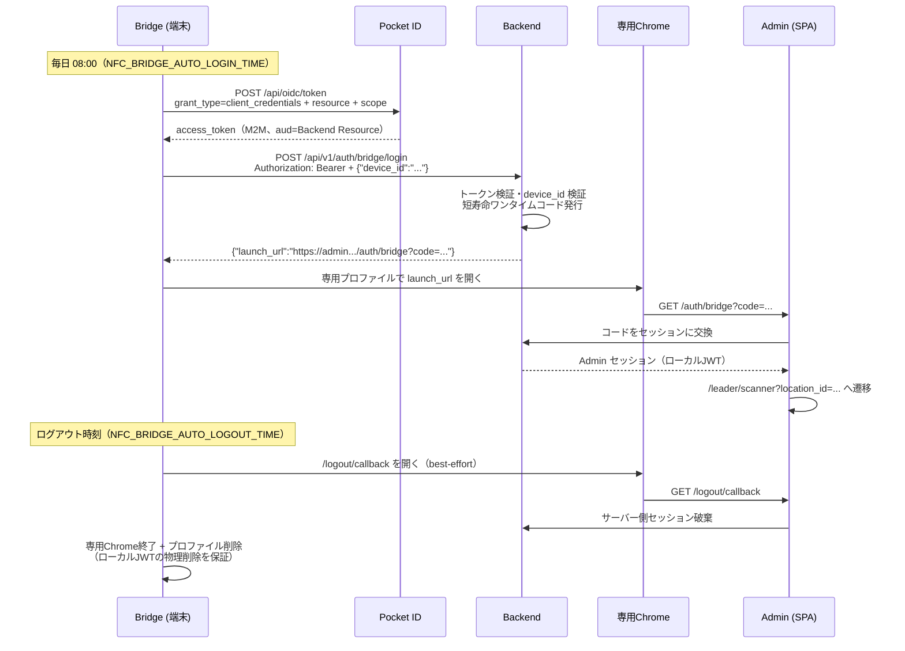

# DR048 Backend / Admin 実装手順書

Bridge の Admin 自動ログイン・ログアウト機能（PR #9）を実際に動かすために必要な、Backend と Admin 側の実装手順。Bridge 側の実装は完了しており、本書の契約部分（エンドポイントパス・リクエスト/レスポンス形式・URL 検証条件）は Bridge のコードが検証している値なので変更しないこと。変更する場合は Bridge の環境変数（Infisical）側も合わせて更新する。

## 全体フロー



## 事前準備（Pocket ID / Infisical）

Backend 実装より先に済ませておくと結合テストがスムーズ。

1. **Pocket ID: Bridge 用 confidential クライアント作成**
   - 新規 OIDC クライアントを「Public Client」トグル **OFF** で作成（Client Credentials は confidential クライアント限定）
   - リダイレクト URI は不要（M2M のため）
   - 発行された Client ID / Client Secret を Infisical `prod` 環境 `/bridge` の
     `NFC_BRIDGE_POCKETID_CLIENT_ID` / `NFC_BRIDGE_POCKETID_CLIENT_SECRET` に設定
   - 既存の Admin / Backend 用 public クライアントには一切手を入れない
2. **Pocket ID: API Resource と permission**
   - Backend を表す API Resource を登録し、その識別子を Infisical の `NFC_BRIDGE_POCKETID_RESOURCE` に設定
   - Resource に `admin:bridge-login` permission を定義し、Bridge クライアントへ付与
3. **Infisical**: `NFC_BRIDGE_LOGIN_EXCHANGE_URL` を Backend の実 URL（`https://<backend>/api/v1/auth/bridge/login`）に差し替え

## Backend 実装手順

### 1. 設定値の追加

| 設定 | 値 | 用途 |
|---|---|---|
| Bridge トークンの issuer | `https://id.tl.tsunagu-sep.org` | 既存の Pocket ID 検証設定を流用可 |
| Bridge トークンの audience | 事前準備 2 で登録した Resource 識別子 | 既存ログイン用トークンとの区別に必須 |
| ログインコード TTL | 60 秒程度 | 短寿命・ワンタイム |

### 2. 端末レジストリ

`device_id` → 拠点情報のマッピングを持つ（DB テーブルか、最初は設定ファイルでも可）。

| カラム | 例 | 備考 |
|---|---|---|
| device_id | `mid-terminal-01` | Infisical の拠点フォルダと同名にする運用 |
| location_id | `1` | ログイン後に遷移するスキャナー URL 用 |
| enabled | true | 端末単位で無効化できるように |

未登録・無効の `device_id` は 403 で拒否する。

### 3. M2M トークン検証

`POST /api/v1/auth/bridge/login` の前段で Bearer トークンを検証する。

- 署名: Pocket ID の JWKS（`/.well-known/openid-configuration` の `jwks_uri`）で RS256 検証。既存実装があれば流用
- `iss` が Pocket ID の issuer と一致
- `aud` が Bridge 用 Resource 識別子と一致（**既存のログイン用トークンを受け付けないための要**）
- `exp` 有効
- scope / permission に `admin:bridge-login` が含まれる

### 4. ログイン交換 API（契約: Bridge 実装済み、変更不可）

```http
POST /api/v1/auth/bridge/login
Authorization: Bearer <Pocket ID M2M access token>
Content-Type: application/json

{"device_id":"mid-terminal-01"}
```

成功レスポンス:

```json
{"launch_url":"https://admin.tl.tsunagu-sep.org/auth/bridge?code=<one-time-code>"}
```

実装要件:

- コードは暗号学的乱数（128bit 以上）で生成し、ハッシュ化して保存（TTL 60 秒、使用済みフラグ付き）
- コードに `device_id` / `location_id` を紐付けて保存する（Admin 遷移先の解決に使う）
- `launch_url` は **HTTPS・Admin origin・パス `/auth/bridge` 完全一致**で組み立てる。Bridge がこの 3 条件で検証しており、違反すると開かずに破棄される
- **Admin の長寿命 JWT を直接返さない**（launch_url + ワンタイムコードのみ）
- 失敗時は 401/403 を返す。Bridge は 30 秒間隔でリトライするため、恒久エラーでもレスポンスは軽量に
- ログにトークン・コードの生値を出さない

### 5. コード→セッション交換 API（パスは自由。以下は例）

```http
POST /api/v1/auth/bridge/exchange
Content-Type: application/json

{"code":"<one-time-code>"}
```

成功レスポンス例:

```json
{"token":"<Adminセッション用JWT>","location_id":1}
```

実装要件:

- コードの存在・TTL・未使用を検証し、**検証と使用済み化はアトミックに**行う（二重使用防止）
- 成功時に Admin セッションを発行。既存のログインセッションと同等の形式でよいが、subject は端末（Bridge 経由）と分かる形にしておくと監査しやすい
- `location_id` を返し、Admin が遷移先を組み立てられるようにする

### 6. セキュリティ要件まとめ

- [ ] audience 検証で既存ログイントークンの流用を遮断
- [ ] コードは 60 秒 TTL・ワンタイム・ハッシュ保存
- [ ] `/api/v1/auth/bridge/*` にレート制限（例: device_id あたり 10 req/min）
- [ ] トークン・コード・セッション JWT をログへ出力しない
- [ ] 監査ログ: いつ・どの device_id がログイン/失敗したか

## Admin 実装手順

### 1. `/auth/bridge` 画面（新設）

Bridge が専用 Chrome で開く入口。パスは Bridge の検証条件（`NFC_BRIDGE_ADMIN_LAUNCH_PATH`、既定 `/auth/bridge`）と一致させること。

処理フロー:

1. クエリ `?code=` を取得。無ければエラー表示
2. Backend のコード交換 API を呼ぶ
3. 成功: セッション（ローカル JWT）を保存し、`/leader/scanner?location_id=<レスポンスの location_id>` へ replace 遷移（履歴に code 付き URL を残さない）
4. 失敗（期限切れ・使用済み）: エラーを表示して終了。**リトライしない**（コードはワンタイム。再ログインは Bridge の次回サイクルに任せる）

注意:

- 画面は無人端末で表示されるため、操作を要求しない（自動で交換→遷移まで完結させる）
- code はログ・エラートラッカーに送らない

### 2. `/logout/callback` 画面（新設）

Bridge がログアウト時刻に best-effort で開く。パスは Bridge 側 `NFC_BRIDGE_ADMIN_LOGOUT_URL`（既定 `https://admin.tl.tsunagu-sep.org/logout/callback`）と一致させること。

処理フロー:

1. Backend にセッション破棄をリクエスト（サーバー側セッション・リフレッシュ系があれば失効）
2. ローカルストレージ / Cookie の JWT を削除
3. 「ログアウトしました」を表示（無人端末なので操作不要で完結）

補足: この画面が開けなくても Bridge が専用 Chrome プロファイルごと削除するためローカル JWT は残らない。この画面の役目は**サーバー側**セッションの後片付け。

## 結合テスト手順

Backend / Admin 実装後、Windows 実機の Bridge と通しで確認する。

- [ ] Pocket ID から M2M トークンが取得できる（`curl` で client_credentials を直接叩いて確認）
- [ ] 正当なトークン + 登録済み device_id で `launch_url` が返る
- [ ] 既存ログイン用（public クライアント）のトークンでは 401/403 になる（audience 検証）
- [ ] 未登録 device_id は 403
- [ ] launch_url を開くと Admin がセッションを取得し MID.スキャナーへ遷移する
- [ ] 同じ code の 2 回目の交換は失敗する（ワンタイム）
- [ ] TTL 経過後の code は失敗する
- [ ] Bridge のログイン時刻に専用 Chrome が起動しスキャナーが表示される（`[AUTH]` ログ確認）
- [ ] ログアウト時刻に専用 Chrome だけが終了し、プロファイルが削除される
- [ ] ログアウト後にサーバー側セッションも失効している
- [ ] Backend 停止中は Bridge が 30 秒間隔でリトライし、復旧後に自動ログインする

## 環境変数対応表（Bridge 側・Infisical 管理）

| Bridge 環境変数 | 対応する Backend / Admin 側の値 |
|---|---|
| `NFC_BRIDGE_POCKETID_CLIENT_ID` / `_SECRET` | Pocket ID の Bridge 用 confidential クライアント |
| `NFC_BRIDGE_POCKETID_RESOURCE` | Pocket ID に登録した Backend の Resource 識別子 = Backend が検証する audience |
| `NFC_BRIDGE_POCKETID_SCOPE`（既定 `admin:bridge-login`） | Backend が要求する permission |
| `NFC_BRIDGE_LOGIN_EXCHANGE_URL` | Backend のログイン交換 API の実 URL |
| `NFC_BRIDGE_ADMIN_ORIGIN` / `NFC_BRIDGE_ADMIN_LAUNCH_PATH` | Admin の origin と `/auth/bridge` のパス |
| `NFC_BRIDGE_ADMIN_LOGOUT_URL` | Admin の `/logout/callback` の URL |
| `NFC_BRIDGE_DEVICE_ID` | Backend の端末レジストリに登録する device_id |
