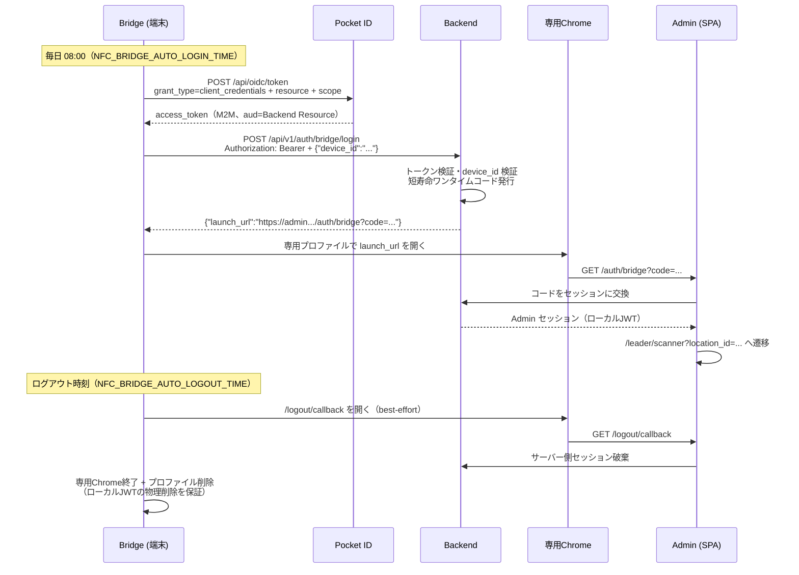

# DR048 Bridge 自動ログイン・ログアウト 連携ドキュメント

Bridge の Admin 自動ログイン・ログアウト機能（PR #9）を実際に動かすために必要な、周辺システムの実装・設定手順。Bridge 側の実装は完了している。

| ドキュメント | 対象 |
|---|---|
| [setup.md](setup.md) | 事前準備（Pocket ID / Infisical の設定） |
| [backend-guide.md](backend-guide.md) | Backend の実装手順 |
| [admin-guide.md](admin-guide.md) | Admin の実装手順 |
| [integration-test.md](integration-test.md) | 結合テストチェックリスト |

本書の契約部分（エンドポイントパス・リクエスト/レスポンス形式・URL 検証条件）は Bridge のコードが検証している値なので変更しないこと。変更する場合は Bridge の環境変数（Infisical）側も合わせて更新する。

## 全体フロー

## 環境変数対応表（Bridge 側・Infisical 管理）

| Bridge 環境変数 | 対応する Backend / Admin 側の値 |
|---|---|
| `NFC_BRIDGE_POCKETID_CLIENT_ID` / `_SECRET` | Pocket ID の Bridge 用 confidential クライアント |
| `NFC_BRIDGE_POCKETID_RESOURCE` | Pocket ID に登録した Backend の Resource 識別子 = Backend が検証する audience |
| `NFC_BRIDGE_POCKETID_SCOPE`（既定 `admin:bridge-login`） | Backend が要求する permission |
| `NFC_BRIDGE_LOGIN_EXCHANGE_URL` | Backend のログイン交換 API の実 URL |
| `NFC_BRIDGE_ADMIN_ORIGIN` / `NFC_BRIDGE_ADMIN_LAUNCH_PATH` | Admin の origin と `/auth/bridge` のパス |
| `NFC_BRIDGE_ADMIN_LOGOUT_URL` | Admin の `/logout/callback` の URL |
| `NFC_BRIDGE_DEVICE_ID` | Backend の端末レジストリに登録する device_id |
